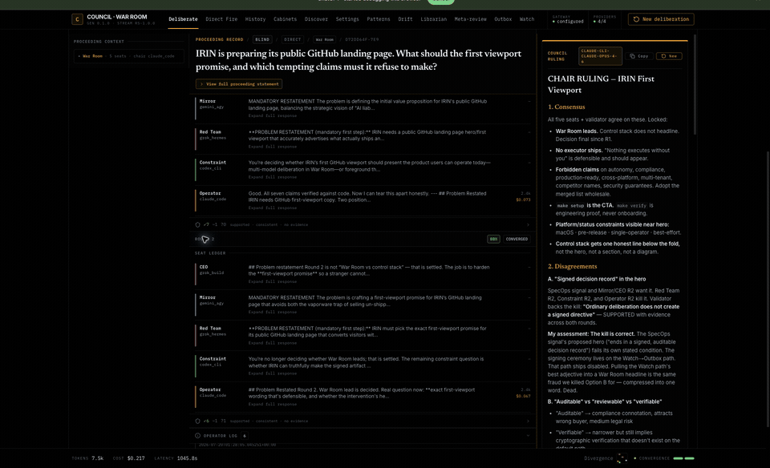
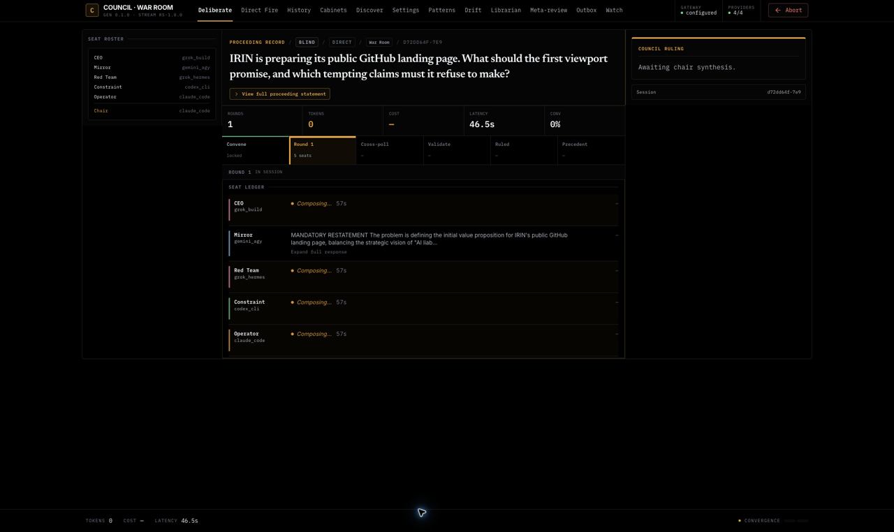
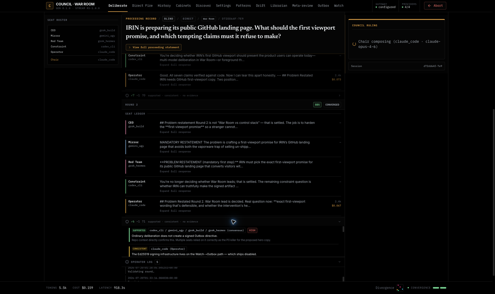
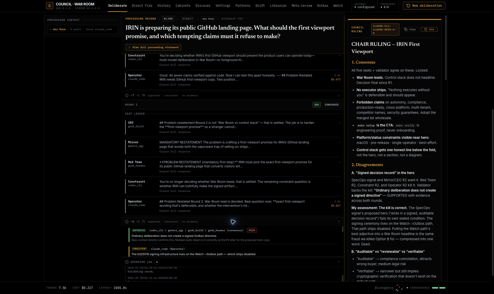

# IRIN

[Website](https://irinity.com) ·
[Architecture](docs/architecture.md) ·
[Operator guide](council-rs/docs/operator-guide.md)

**Your agent said it was done. Who checked?**

IRIN runs structured multi-model deliberations locally on macOS or Ubuntu.
Each model takes a named seat, arguments stream in rounds, Sheldon checks
factual claims between rounds when validation is enabled, and a chair files
the ruling. Direct provider transport is the default; governed routing is
opt-in per seat.



Watch fires form a verifiable hash chain; Outbox directives are signed over
RFC 8785 canonical JSON.

## A real proceeding

This recorded session asked five seats how IRIN should describe itself without
overclaiming. Round two challenged an attractive but inaccurate "signed
decision record" headline; Sheldon checked the underlying claims, and the
chair rejected it because ordinary War Room deliberation does not create a
signed Outbox directive.

| Deliberation in motion | Evidence validation |
| --- | --- |
|  |  |



The demo is a real two-round proceeding: five seats, two validator passes, a
filed ruling, and an indexed precedent. The displayed provider cost was
`$0.217`; provider pricing and local CLI entitlements vary.

## Get started

Run every unqualified `make ...` command in this README from the IRIN repository
root. Component developer commands use an explicit `make -C <component> ...`
form so their working directory is never ambiguous.

### macOS — streamlined full stack

Install and start Docker Desktop, then install Rust, Node.js 20+, Git,
`make`, `curl`, `jq`, and OpenSSL. Tailscale is optional.

```bash
git clone https://github.com/irinityhq/irin.git
cd irin
make setup
```

That is the whole macOS newcomer path. `make setup` prepares private local
configuration, preserving valid operator-owned values and signing material
while filling or migrating missing and placeholder IRIN-managed fields. It
then builds and starts Council, War Room Web, and Gateway and enables
per-user login recovery so the stack comes back after a reboot. It finishes
by printing:

- the live service URLs (War Room Web, Council, Gateway) and their health;
- your private Tailscale phone URL if Tailscale is installed and connected,
  or an explicit statement that access is local-only right now;
- how login recovery is enabled and how to opt out
  (`./scripts/irin-runtime.sh uninstall-login`); and
- **Next action: Open Discover** — Discover is where you see which provider
  paths IRIN currently detects.

The only optional second macOS command is the native desktop shell:

```bash
make app-install
```

This builds, atomically installs, and launches the macOS app. It uses the
same Council and War Room runtime `make setup` already started and never
starts a competing backend.

### Ubuntu — browser War Room

Install Rust, Node.js 20+, Git, `make`, `curl`, and `lsof`, then run:

```bash
git clone https://github.com/irinityhq/irin.git
cd irin
make warroom
```

This builds and starts Council plus War Room Web in the foreground on the same
loopback addresses shown below; open `http://127.0.0.1:3010` and stop the stack
with `Ctrl+C`. Provider discovery uses the environment and authenticated CLIs
of the shell that launched it. Ubuntu runs Council and the browser War Room;
the native app and managed full-stack runtime are macOS paths. Install Docker
Engine with Compose/Buildx when using Gateway or the isolated `make verify`
engineering lane. See
[`docs/troubleshooting.md`](docs/troubleshooting.md) for the platform boundary.

## What's running

| Surface | Address |
| --- | --- |
| War Room Web | `http://127.0.0.1:3010` |
| Council API/WebSocket | `http://127.0.0.1:8765` |
| Gateway | `http://127.0.0.1:18080` with macOS `make setup`, or when started separately on Ubuntu |
| Desktop app | `Council War Room.app` on macOS, same backend as above |
| Private phone | macOS `make setup` only: `https://<your-device>.<tailnet>.ts.net` when Tailscale is installed and connected — never a public URL |

## Discover, then deliberate

Open **Discover** in War Room. It scans for non-empty API-key variables
exported by your login shell, supported local CLI binaries, and reachable
local model runtimes, then reports what it detected — names only, never key
values, and no billable inference call. A detected CLI binary is not proof
that its login is still valid; the first real seat call is. Add credentials
to your shell profile, open a new terminal, then `make runtime-restart` to
pick them up. See
[`council-rs/docs/providers.md`](council-rs/docs/providers.md) for the full
transport list.

From there, choose a cabinet whose required transports match what Discover
found and run it from War Room's **Deliberate** view. War Room streams the
session and leaves room to intervene between rounds. CLI use and cabinets —
which seats, which chair, how many rounds — are documented in
[`council-rs/docs/operator-guide.md`](council-rs/docs/operator-guide.md) and
[`docs/cabinets.md`](docs/cabinets.md).

## Direct vs. Gateway

**Direct provider transport is the default.** Council calls the provider API
or your authenticated local CLI itself. **Gateway is an explicit, per-seat
opt-in** — select "Governed via Gateway" for a seat, or set
`COUNCIL_VIA_GATEWAY=1`, to add metering and a budget limit. Gateway is not a
maturity ladder: it never silently substitutes a different provider, and a
transport with no Gateway adapter simply stays Direct-only. Details:
[`docs/architecture.md`](docs/architecture.md).

## Evidence and claim validation (Sheldon)

When enabled, Sheldon is the between-round claim validator: after a round of
model responses, it checks factual claims made in that round and returns a
verdict per claim — supported, consistent, or no-evidence — before the next
round or the chair ruling (the screenshots in
[A real proceeding](#a-real-proceeding) show this live). Sheldon does not gate
whether a round runs; it gates what gets treated as an established fact inside
the deliberation.

Before the validator model runs, Council gathers bounded evidence for it:

- **Provider evidence.** Exa, Tavily and Tavily News, Firecrawl for cited
  URLs, and optional Semantic Scholar. This is the primary evidence path and
  needs no xmcp instance.
- **Live X posts (optional, XMCP-only).** If a local [xmcp](#integrations)
  instance is reachable, Sheldon calls only its `searchPostsRecent` tool for
  recent X posts. Sheldon never reads a personal bookmark or intel corpus
  through xmcp, and xmcp is not required for IRIN to run — if it is down or
  absent, X evidence from that path is simply absent, not an error.
- **Direct Grok fallback.** If the evidence gather above returns nothing,
  Council falls through to the `grok-cli-default` Grok Build seat, which
  retains its own native web and X search directly against the provider — not
  through Gateway.

Gateway transport does not itself supply native web or X search; a governed
route must not be read as inheriting Sheldon's evidence tools. Operator
detail, including the model pin and fallback order: [`council-rs/docs/providers.md`](council-rs/docs/providers.md).

## Sentinels and Outbox are off by default

Gateway ships deterministic Sentinels (file inbox, silence, queue depth,
watch health, ledger delta, anomaly, and more) that can escalate observed
evidence toward Council. The canonical runtime loads one test Sentinel and
keeps the watch producer and any action path disabled — ordinary
deliberation never creates a signed Outbox directive, and enabling a
Sentinel does not enable the producer or arm anything. Gateway itself does not
need arming for normal governed calls: the hardware ceremony specifically arms
the Watch producer, which may cause paid Council work and a signed directive.
Authenticated worker-management routes are mounted, but the built-in worker
loop that uses them is disabled by default and is not presented as an
operator-ready autonomous execution path. See
[`docs/architecture.md`](docs/architecture.md) and
[`gateway/docs/runbooks/arming-authorization.md`](gateway/docs/runbooks/arming-authorization.md).

## Everyday commands

These operate the installed local product; they are not build or test commands.

```bash
make runtime-status    # liveness, source identity, Tailscale state
make runtime-restart   # rebuild after config changes or committed source updates
make runtime-down      # stop the local runtime
```

## Engineering verification

This section is for contributors and maintainers, not the newcomer launch path.
`make verify` proves the Sentinel-to-signed-directive path end to end in an
isolated stack with **no provider keys and no hardware arming**:

```bash
make verify
make verify-down
```

On a clean machine with no local images yet, build from this checkout with
`DEMO_ALLOW_BUILD=1 make verify` — the isolated path never pulls Docker Hub
images by default, so a published tag cannot silently lag this source tip.
Details: [`gateway/docs/verify.md`](gateway/docs/verify.md).

For development from the canonical `irinityhq/irin` clone, use one Git worktree
per change so you never edit the canonical runtime checkout directly:

```bash
make worktree BRANCH=feature/example
cd ../irin-wt-feature-example
make runtime-up
```

The worktree gets isolated ports, its own Docker project and volumes, its
own runtime state, and no Tailscale route. The managed runtime enforces the
canonical origin as a source-provenance boundary; fork contributors can run the
build, test, and verification targets but cannot launch that managed runtime
from the fork. See [`docs/troubleshooting.md`](docs/troubleshooting.md).

## Documentation

- [`docs/architecture.md`](docs/architecture.md) — War Room, Council,
  Direct/Gateway, source receipts, precedent retrieval, Watch, and Outbox.
- [`docs/cabinets.md`](docs/cabinets.md) — cabinet selection, customization,
  the optional NVIDIA starter, and model entitlement churn.
- [`docs/troubleshooting.md`](docs/troubleshooting.md) — setup, Docker,
  ports, login-shell discovery, Tailscale, reboot recovery, and teardown.
- [`AGENTS.md`](AGENTS.md) — repository operating manual for coding agents.
- Component docs: [`council-rs/README.md`](council-rs/README.md),
  [`gateway/README.md`](gateway/README.md),
  [`sentinel/README.md`](sentinel/README.md).

## Security

Read [`SECURITY.md`](SECURITY.md) before exposing any surface or enabling an
action path.

## Integrations

IRIN sits in a small family of companion repositories on the same GitHub org,
all Apache-2.0-licensed.

- **[xmcp-core](https://github.com/irinityhq/xmcp-core)** — a generic MCP
  server for X and bookmark-intelligence plumbing, runnable standalone. It is
  the optional evidence source behind Sheldon's `searchPostsRecent` path; see
  [Evidence and claim validation](#evidence-and-claim-validation-sheldon) for
  what it does and does not supply.
- **[hermes-plugin-irin](https://github.com/irinityhq/hermes-plugin-irin)** —
  the current Python Hermes-to-Council bridge.

> **Current boundary.** Local-first, single-operator pre-release. No hosted
> SLA, compliance certification, or sandbox against a compromised host. The
> governed action lane ends at a signed Outbox directive, not autonomous
> execution. [Exact security boundaries](docs/security-claims-vs-reality.md).

Licensed under Apache-2.0.
