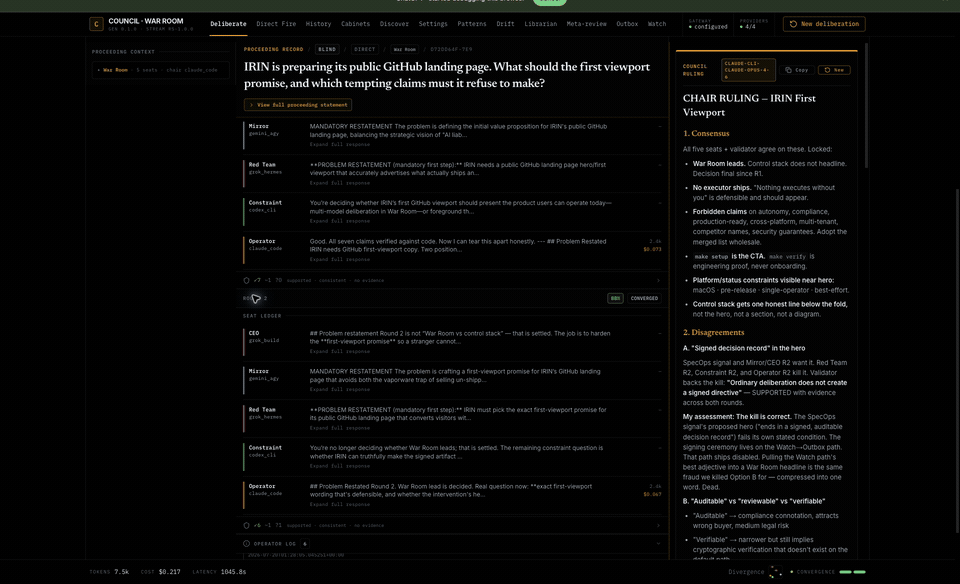
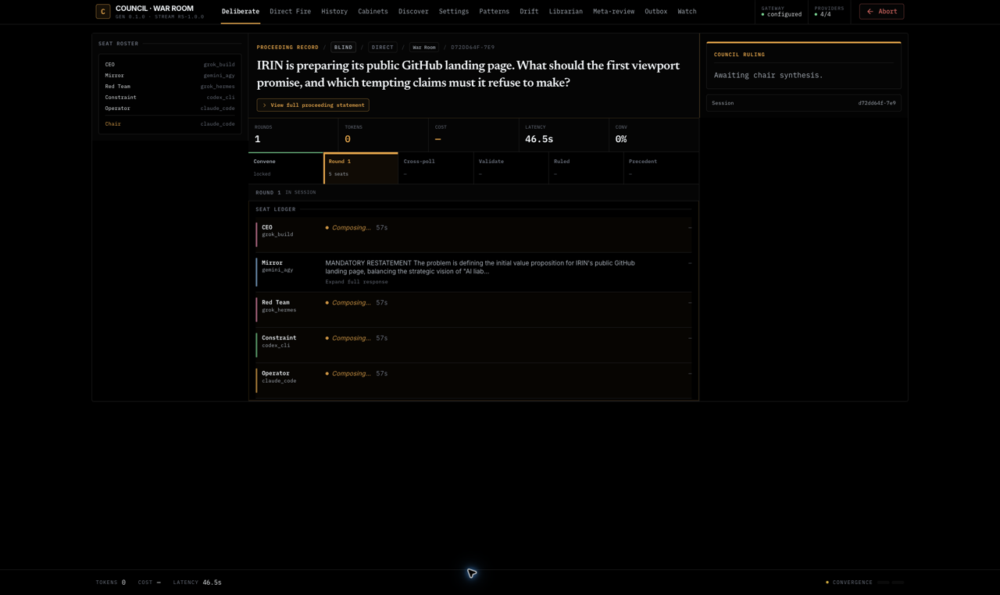
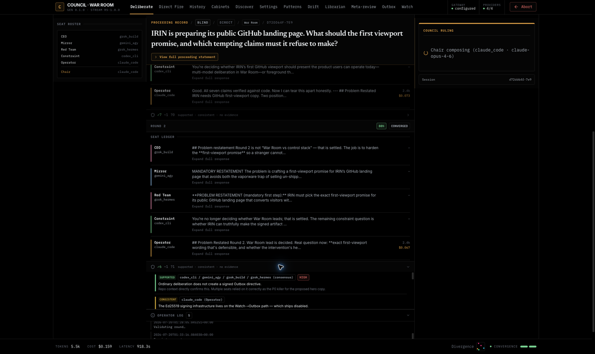
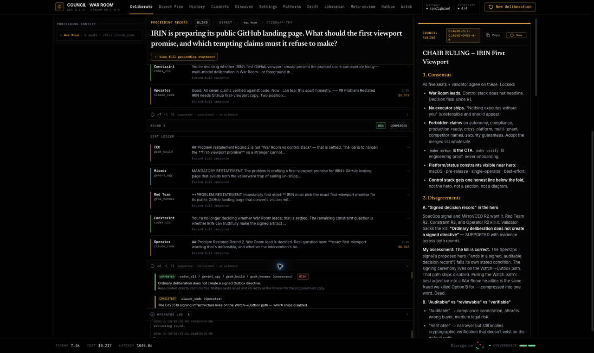

# IRIN

[Website](https://irinity.com) ·
[Architecture](docs/architecture.md) ·
[Operator guide](council-rs/docs/operator-guide.md)

**Your agent said it was done. Who checked?**

IRIN runs structured multi-model deliberations locally on macOS or Ubuntu.
Each model takes a named seat, arguments stream in rounds, Sheldon checks
factual claims between rounds when validation is enabled, and a chair files
the ruling. Direct provider transport is the default; governed routing is
opt-in per seat.

[irinity.com](https://www.irinity.com/) · [IRINITY STONES — the IRIN field guide](https://irinitystones.com/)



Watch fires form a verifiable hash chain; Outbox directives are signed over
RFC 8785 canonical JSON.

## A real proceeding

This recorded session asked five seats how IRIN should describe itself without
overclaiming. Round two challenged an attractive but inaccurate "signed
decision record" headline; Sheldon checked the underlying claims, and the
chair rejected it because ordinary War Room deliberation does not create a
signed Outbox directive.

| Deliberation in motion | Evidence validation |
| --- | --- |
|  |  |



The recorded session is a real two-round proceeding: five seats, two
validator passes, a filed ruling, and an indexed precedent. The displayed
provider cost was `$0.217`; provider pricing and local CLI entitlements vary.

## Get started

The ordinary product path is the signed macOS app: one download, no build
tools. The `make ...` commands after it are development paths from a source
checkout, not the product install. Run every unqualified `make ...` command
in this README from the IRIN repository root. Component developer commands
use an explicit `make -C <component> ...` form so their working directory is
never ambiguous.

### macOS — the signed app (product install)

The notarized `IRIN_<ver>_aarch64.dmg` on
[GitHub Releases](https://github.com/irinityhq/irin/releases) installs
**IRIN.app** — the same Council + War Room with the optional Gateway Pack
bundled and off by default. No source checkout, Docker, or `make` is
required for Direct mode. macOS on Apple silicon only; Intel Macs are not
supported.

1. Download `IRIN_<ver>_aarch64.dmg` from the Releases page.
2. Verify the download against `HASHES.txt` attached to the same release.
3. Open the DMG, drag **IRIN.app** to Applications, and launch it.

The app starts and owns its bundled Council and serves War Room on loopback;
no terminal command is involved. An occupied Council port is a startup
conflict — the app will not adopt or kill another process. Open **Discover**
first to see which provider transports IRIN detects (see
[Discover, then deliberate](#discover-then-deliberate)).

### macOS — browser War Room from source (development)

This is the development path, not the product install. Install Rust, Node.js
20+, Git, `make`, `curl`, and OpenSSL. Docker Desktop is required only for
Gateway Pack development or `make verify`.

```bash
git clone https://github.com/irinityhq/irin.git
cd irin
make warroom
```

That starts Council plus War Room Web in the foreground. Open
`http://127.0.0.1:3010` and stop with `Ctrl+C`. There is no source-managed
login recovery and no `make setup` / `make runtime-*` product path — the
installed app owns Council lifecycle; source development uses the foreground
tree.

The macOS desktop product is the signed DMG from GitHub Releases (`IRIN.app`).

### Ubuntu — browser War Room from source

Install Rust, Node.js 20+, Git, `make`, `curl`, and `lsof`, then run:

```bash
git clone https://github.com/irinityhq/irin.git
cd irin
make warroom
```

This builds and starts Council plus War Room Web in the foreground on the same
loopback addresses shown below; open `http://127.0.0.1:3010` and stop the stack
with `Ctrl+C`. Provider discovery uses the environment and authenticated CLIs
of the shell that launched it. Ubuntu runs Council and the browser War Room;
the native app is a macOS product path. Install Docker Engine with
Compose/Buildx when using Gateway or the isolated `make verify` engineering
lane. See [`docs/troubleshooting.md`](docs/troubleshooting.md) for the
platform boundary.

## What's running

| Surface | Address |
| --- | --- |
| War Room Web (source) | `http://127.0.0.1:3010` via `make warroom` |
| Council API/WebSocket | `http://127.0.0.1:8765` (app-owned in the DMG; foreground in `make warroom`) |
| Gateway | Optional: installed app Gateway Pack, or compose from `gateway/` for development |
| Desktop app | `IRIN.app` on macOS — the signed DMG always starts and owns its bundled Council |
| Private phone | Installed IRIN.app Settings only: `https://<your-device>.<tailnet>.ts.net:8443` via Tailscale Serve — open in a browser on the same tailnet; never a public URL |

## Discover, then deliberate

Open **Discover** in War Room. It scans for non-empty API-key variables
exported by your login shell, supported local CLI binaries, and reachable
local model runtimes, then reports what it detected — names only, never key
values, and no billable inference call. A detected CLI binary is not proof
that its login is still valid; the first real seat call is. Add credentials
to your shell profile, open a new terminal, then relaunch `make warroom` or
IRIN.app to pick them up. See
[`council-rs/docs/providers.md`](council-rs/docs/providers.md) for the full
transport list.

From there, choose a cabinet whose required transports match what Discover
found and run it from War Room's **Deliberate** view. War Room streams the
session and leaves room to intervene between rounds. CLI use and cabinets —
which seats, which chair, how many rounds — are documented in
[`council-rs/docs/operator-guide.md`](council-rs/docs/operator-guide.md) and
[`docs/cabinets.md`](docs/cabinets.md).

## Direct vs. Gateway

**Direct provider transport is the default.** Council calls the provider API
or your authenticated local CLI itself. **Gateway is an explicit, per-seat
opt-in** — select "Governed via Gateway" for a seat, or set
`COUNCIL_VIA_GATEWAY=1`, to add metering and a budget limit. Gateway is not a
maturity ladder: it never silently substitutes a different provider, and a
transport with no Gateway adapter simply stays Direct-only. Details:
[`docs/architecture.md`](docs/architecture.md).

On the **installed macOS DMG**, core War Room needs no Docker and keeps Gateway
off by default. Optional governed routing uses Settings → **Enable Gateway**,
which starts an app-owned Compose project (`irin-desktop-gateway`), stores the
Council client key in the macOS Keychain, and only enables governed proceedings
after authenticated readiness. See
[`packaging/gateway-pack/README.md`](packaging/gateway-pack/README.md) for the
v0.1 support matrix. In the pack, Vertex and the Gemini CLI proxy stay
Direct-only; the Claude and Codex CLI proxies are supported when the
operator's CLIs are installed and authenticated.

## Evidence and claim validation (Sheldon)

Sheldon is the between-round claim validator: after a round of model responses,
it checks factual claims made in that round and returns a verdict per claim —
supported, consistent, no-evidence, or contradicted — before the next round
or the chair ruling (the screenshots in [A real proceeding](#a-real-proceeding)
show this live). Sheldon does not gate whether a round runs; it gates what gets
treated as an established fact inside the deliberation.

Before the validator model runs, Council gathers bounded evidence for it:

- **Provider evidence.** Exa, Tavily and Tavily News, Firecrawl for cited
  URLs, and optional Semantic Scholar. This is the primary evidence path.
- **Direct Grok fallback.** If the evidence gather above returns nothing,
  Council falls through to the `grok-cli-default` Grok Build seat, which
  retains its own native web and X search directly against the provider — not
  through Gateway.

IRIN does not talk to a local xmcp instance. Sheldon does not gather live X
posts through that path.

Gateway transport does not itself supply native web or X search; a governed
route must not be read as inheriting Sheldon's evidence tools. Operator
detail, including the model pin and fallback order: [`council-rs/docs/providers.md`](council-rs/docs/providers.md).

## Sentinels and Outbox are off by default

Gateway ships deterministic Sentinels (file inbox, silence, queue depth,
watch health, ledger delta, anomaly, and more) that can escalate observed
evidence toward Council. The canonical runtime loads no Sentinel profile by
default. Two committed profiles can load one: the development canary fixture
(`gateway/test/fixtures/canary-sentinels.yaml`), pinned by the canary compose
overlay, and the packaged app's bundled default profile
(`packaging/gateway-pack/default-sentinels.yaml`), installed only when the
operator turns the desktop watch profile on. The runtime keeps the watch
producer and any action path disabled. Ordinary deliberation never creates a
signed Outbox directive, and enabling a Sentinel does not enable the producer
or arm anything. Gateway itself does not need arming for normal governed calls:
the hardware ceremony specifically arms the Watch producer, which may cause paid
Council work and a signed directive.
Authenticated worker-management routes are mounted, but the built-in worker
loop that uses them is disabled by default and is not presented as an
operator-ready autonomous execution path. See
[`docs/architecture.md`](docs/architecture.md) and
[`gateway/docs/runbooks/arming-authorization.md`](gateway/docs/runbooks/arming-authorization.md).

## Everyday commands

Installed IRIN.app needs none of these source-development commands. Optional
Gateway compose config for development:

```bash
make gateway-prepare-config   # private gateway.env + ledger key only
```

## Engineering verification

This section is for contributors and maintainers, not the newcomer launch path.
`make verify` proves the Sentinel-to-signed-directive path end to end in an
isolated stack with **no provider keys and no hardware arming**:

```bash
make verify
make verify-down
```

On a clean machine with no local images yet, build from this checkout with
`DEMO_ALLOW_BUILD=1 make verify` — the isolated path never pulls Docker Hub
images by default, so a published tag cannot silently lag this source tip.
Details: [`gateway/docs/verify.md`](gateway/docs/verify.md).

For development from the canonical `irinityhq/irin` clone, use one Git worktree
per change:

```bash
make worktree BRANCH=feature/example
cd ../irin-wt-feature-example
make warroom
```

The worktree gets isolated ports and its own Docker project name. See
[`docs/troubleshooting.md`](docs/troubleshooting.md).

## Documentation

- [`docs/architecture.md`](docs/architecture.md) — War Room, Council,
  Direct/Gateway, precedent retrieval, Watch, and Outbox.
- [`docs/surface-map.md`](docs/surface-map.md) — compact index of Watch,
  Gateway core, and protocol surfaces, with their defaults and guards.
- [`docs/cross-process-boundaries.md`](docs/cross-process-boundaries.md) —
  process/language boundary inventory (Lua↔sidecar, governed headers, spawn env).
- [`docs/security-tooling.md`](docs/security-tooling.md) — local scanners,
  Selene, and the config-key search convention.
- [`docs/cabinets.md`](docs/cabinets.md) — cabinet selection, customization,
  the optional NVIDIA starter, and model entitlement churn.
- [`docs/troubleshooting.md`](docs/troubleshooting.md) — Docker, ports,
  login-shell discovery, Tailscale, and teardown.
- Component docs: [`council-rs/README.md`](council-rs/README.md),
  [`gateway/README.md`](gateway/README.md),
  [`sentinel/README.md`](sentinel/README.md).

## Security

Read [`SECURITY.md`](SECURITY.md) before exposing any surface or enabling an
action path.

## Integrations

IRIN sits in a small family of companion repositories on the same GitHub org,
all Apache-2.0-licensed.

- **[xmcp-core](https://github.com/irinityhq/xmcp-core)** — a generic MCP
  server for X and bookmark-intelligence plumbing, runnable standalone. IRIN
  no longer talks to a local xmcp instance.
- **[hermes-plugin-irin](https://github.com/irinityhq/hermes-plugin-irin)** —
  the current Python Hermes-to-Council bridge.

> **Current boundary.** Local-first, single-operator pre-release. No hosted
> SLA, compliance certification, or sandbox against a compromised host. The
> governed action lane ends at a signed Outbox directive, not autonomous
> execution. [Exact security boundaries](docs/security-claims-vs-reality.md).

Licensed under Apache-2.0.
